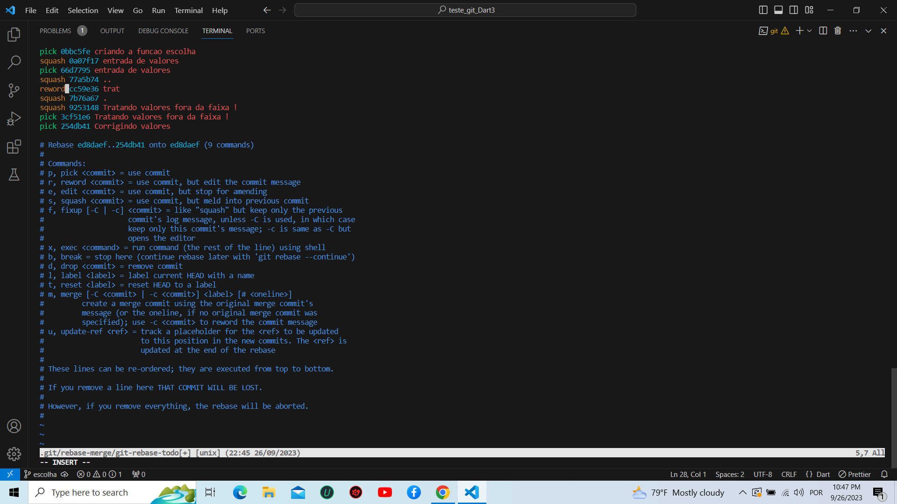

# PRATICANDO O REBASE

  Este projeto visa a prática dos comandos do git.

## Comandos do git mais usados no projeto

* git rebase branch private_branch -i
* squash
* reword
* git status 
* git add .
* git commit -a -m 
* git merge
* git push

## Funções do github utilizadas no projeto

* issues.
* project
* pull requests

### Image do rebase do git 

* O intuito é mostrar como funciona o rebase no git 

##### LinkedIn

[https://www.linkedin.com/feed/](https://www.linkedin.com/feed/)